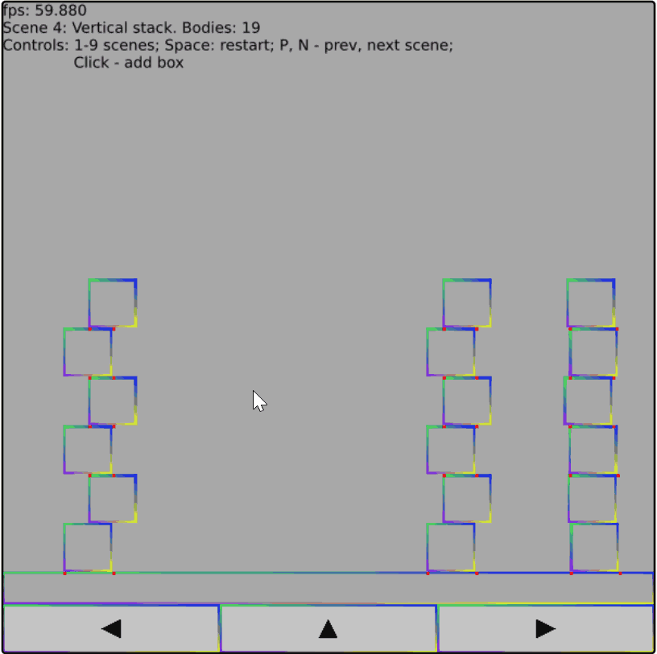

# Box2D-Lite-rs
Box2D-Lite is a small 2D physics engine. It was developed for the [2006 GDC Physics Tutorial](docs/GDC2006_Catto_Erin_PhysicsTutorial.pdf). This is the original version of the larger [Box2D](https://box2d.org) library. The Lite version is more suitable for learning about game physics.  

Original C++ version: https://github.com/erincatto/box2d-lite/tree/master  
Big thanks to the author Erin Catto.  

[Check runnable version online.](https://xcemaxx.github.io/box2d-lite-rs/)

# Building and running
- [Install wasp-pack](https://rustwasm.github.io/wasm-pack/installer/)  
- Go to gui folder of the project: `cd gui`
- Build with: `wasm-pack build --target web --dev` or `wasm-pack build --target web --release`
- Run server with:
`python -m http.server 7000`
- Open site with: http://localhost:7000  

# Show
[Check by yourself online](https://xcemaxx.github.io/box2d-lite-rs/)  

# Helpful resources
## Wgpu
https://github.com/vhiribarren/wgpu-sandbox/tree/main  
https://github.com/gfx-rs/wgpu/tree/trunk/examples/src/hello_triangle  
https://github.com/Blatko1/wgpu-text/tree/master  
https://github.com/sotrh/learn-wgpu/tree/master/code/showcase/pong/src  
https://github.com/jack1232/WebGPU-Step-By-Step  

## Wasm
https://blog.logrocket.com/getting-started-with-webassembly-and-rust/  
https://github.com/rustwasm/wasm-bindgen  
https://rustwasm.github.io/docs/book/game-of-life/hello-world.html  